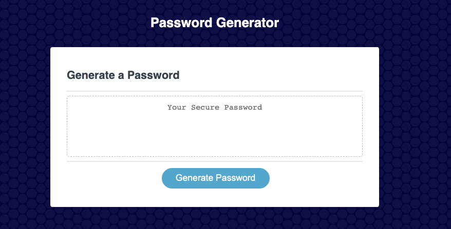
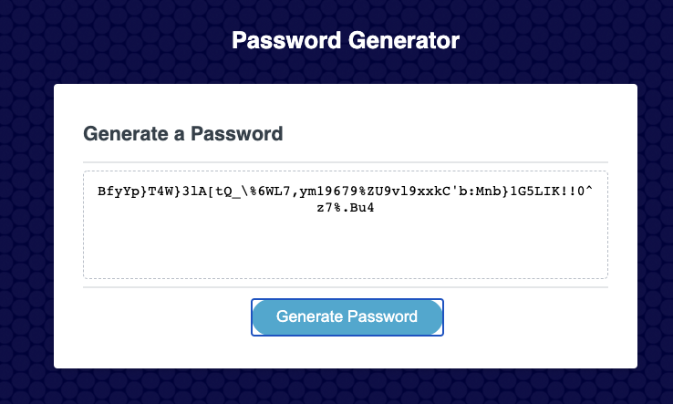

## PASSWORD GENERATOR 

This application generates a random password based on user-selected criteria. This app will run in the browser and feature dynamically updated HTML and CSS powered by JavaScript codes. It will also feature a clean and polished user interface and be responsive, ensuring that it adapts to multiple screen sizes.

## Tech used

- HTML
- CSS
- JavaScript

## Deployment

please access the following URL:

https://noriyuki-ishii-820.github.io/PasswordGenerator/

## Screenshots

1) the UI provides the user the button to start the password generation.

2) with the criteria the user selected (numeric, lowercase, uppercase and special letters) the application would generate a password.

## License

MIT

## Contact

nishii.dev.syd@gmail.com
